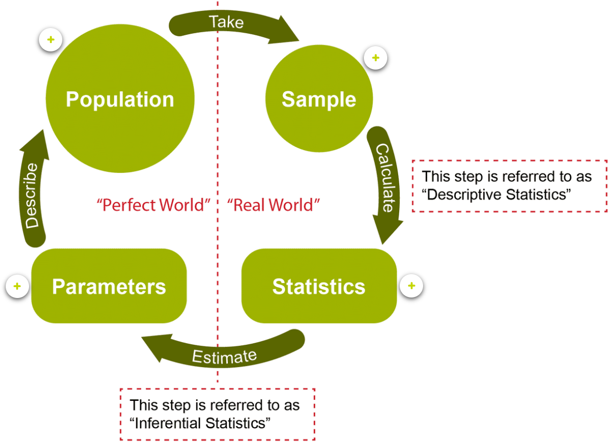
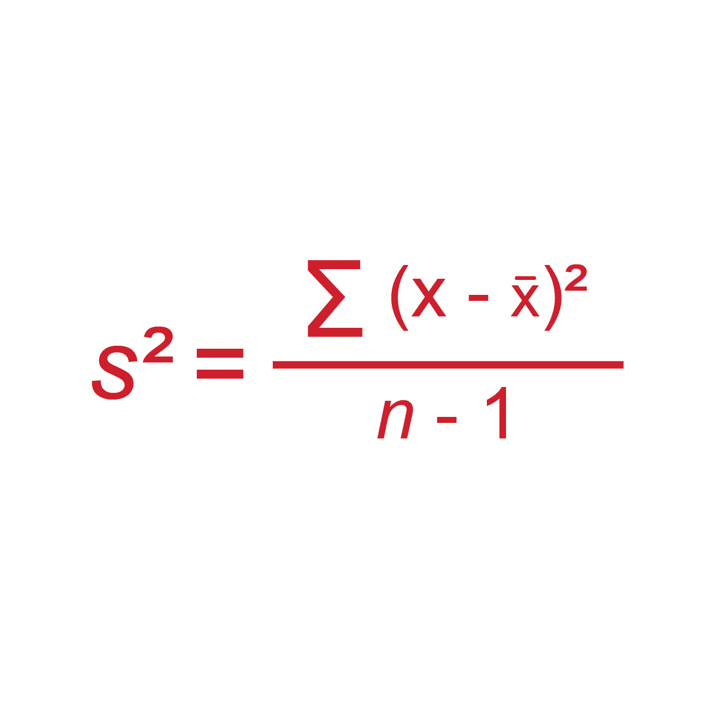

* Discriptive statistics
* Inferencial statistics

## Scales of measurement
* Nominal scales
    - Gender, colour, relegion
* Ordinal
    - Customer satisfaction
* Interval
    - Temperature
* Ratio
    - Money
    - Has a "true zero" point

## Measures of location

* Mean - Average that describes the center of the frequency description.

* Mode - The number that occurs most frequently.

* Median - Middle number in a list of numbers that has been ordered.

## Measures of variability

* Range
    - Used in conjunction with the Median
    - Largest Value - smallest Value.

* Interquartile Range (IQR)
    - Used in conjunction with the Median
    - Range of the middle 50% of numbers in a distribution
    - 75th percentile - 25th percentile.

* Variance
    - Used in conjunction with the Mean.

    

    

* Standard Deviation;
    - Used in conjunction with the Mean.
    - 68% within +/- 1 SD of mean
    - 95% within +/- 2 SD of mean
