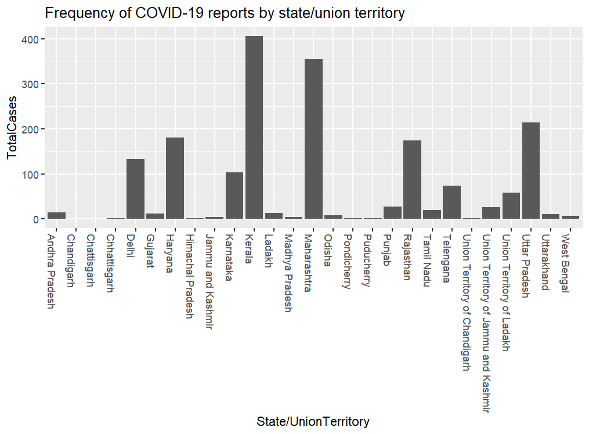
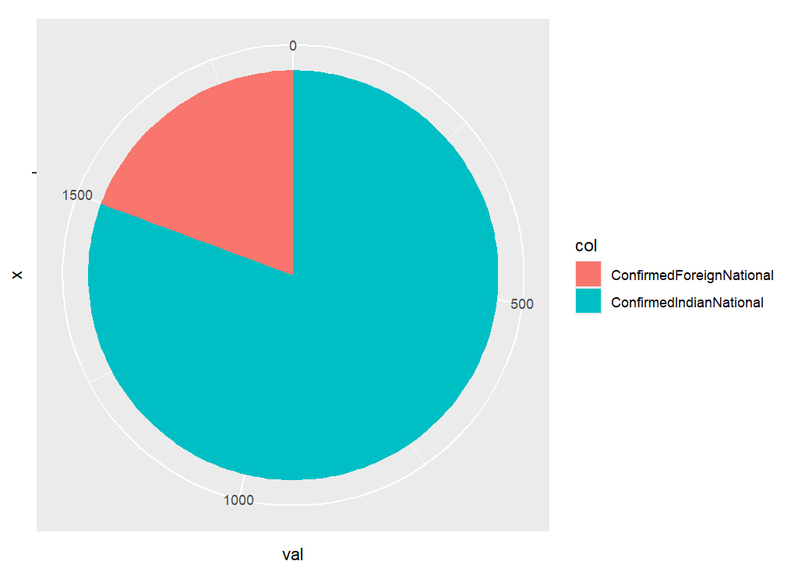

## Create a bar chart showing the frequency of COVID-19 reports by state/union territory

```
> df %>%
+     dplyr::mutate(TotalCases = ConfirmedIndianNational + ConfirmedForeignNational) %>%
+     ggplot2::ggplot(aes(`State/UnionTerritory`, TotalCases)) +
+         geom_col() +
+         labs(title = "Frequency of COVID-19 reports by state/union territory") + 
+         theme(axis.text.x=element_text(angle = -90, hjust = 0))
```



## Using variables ConfirmedIndianNational and ConfirmedForeignNational, create a pie chart showing the distribution of case severity levels based on total confirmed cases

There are no built-in `geom` within ggplot2 for creating pie charts. The below approach uses a workaround as documented within the article referenced below.

*ggplot2 Piechart* (no date). Available at: https://r-graph-gallery.com/piechart-ggplot2.html (Accessed: January 1, 2026)

```
> dfnew <- data.frame(col = c("ConfirmedIndianNational", "ConfirmedForeignNational"),
+                     val = c(sum(df$ConfirmedIndianNational), sum(df$ConfirmedForeignNational)))
> 
> dfnew %>% ggplot2::ggplot(aes("", val, fill = col)) +
+     geom_bar(stat = "identity", width = 1) +
+     coord_polar("y", start = 0)
```



## Create a histogram showing the distribution of recovery numbers

## Create a line chart showing the trend of total cases over time
